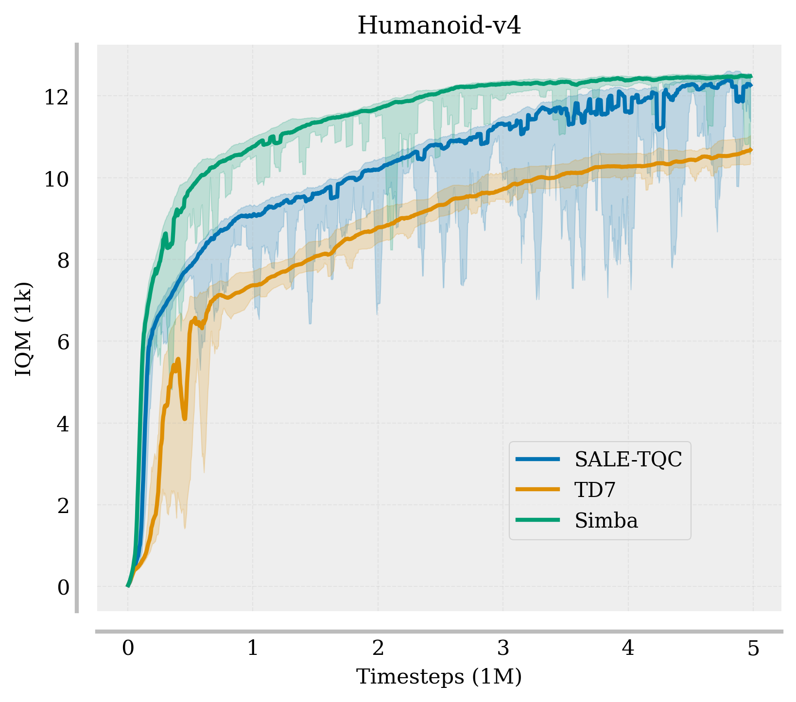

# JAX-Based Off-Policy RL Algorithms

This repository contains a **JAX-based implementation** of various **off-policy reinforcement learning (RL) algorithms**, focusing on leveraging JAX for efficiency.

## Features
- **Efficient JAX Implementation**: Optimized for speed and performance.
- **Clean and Simple Code**: Designed for clarity and ease of understanding.
- **Comparison with PyTorch**: Includes benchmarks comparing training speed against PyTorch implementations.

## Implemented Algorithms
- **TD7**
- **SALE-TQC** : SALE Representation (TD7) + TQC
- **SIMBA**

## Learning Curves
- With 5 seeds experiment, 95% Confidence interval


---
### Getting Started
```bash
# Clone the repository
git clone https://github.com/seungju-k1m/jax-offpolicy-rl.git
cd jax-offpolicy-rl

# Install dependencies
rye sync
```

### Usage
```bash
rye run python cli.py td7 --env-id Humanoid-v4 --save-path "save/TD7" --seed 1 --use-progressbar
```

### Results
The repository includes scripts to visualize learning curves and compare training efficiency.